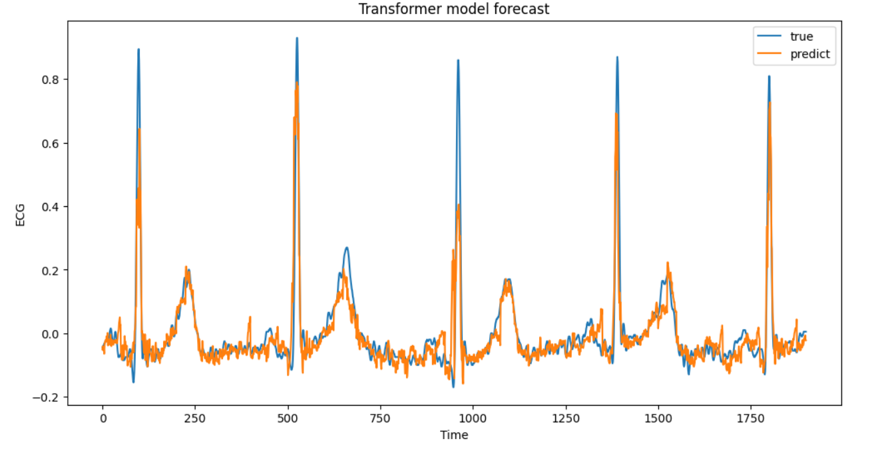

# Research
Use ARIMA, RNN ,LSTM ,Transformer to predict ECG data

ARIMA: ARIMA_local.ipynb 

RNN&LSTM single step: LSTM_one_step_local.ipynb

RNN&LSTM multistep step: LSTM_multiple_step_local.ipynb

Transformer: ./informer/informer.ipynb

  
<b>Figure 3.</b> An predict of the ECG data.

Fitting result of Transformer model:

|Input Length| Hidden unit| Forecast Lenth|Test RMSE|Test R2  |
| ----------- | ----------- | ----------- | ----------- | ----------- |  
|1|128|1|0.004607|0.96190|
|5|128|1|0.035841|0.94453|
|5|512|1|0.039515|0.93254|
|8|128|1|0.070479|0.78558|
|10|128|1|0.06866|0.79652|
|10|512|1|0.01472|0.61062|
|15|128|1|0.021716|0.63117|
|20|128|1|0.021053|0.20606|
|25|128|1|0.021716|0.15371|
|25|512|1|0.019989|0.28464|
|25|512|5|0.012705|0.71109|
|30|128|1|0.021278|0.18980|
|50|512|25|0.009684|0.83293|
|80|512|25|0.012824|0.70580|
|250|512|25|0.022158|0.12177|
